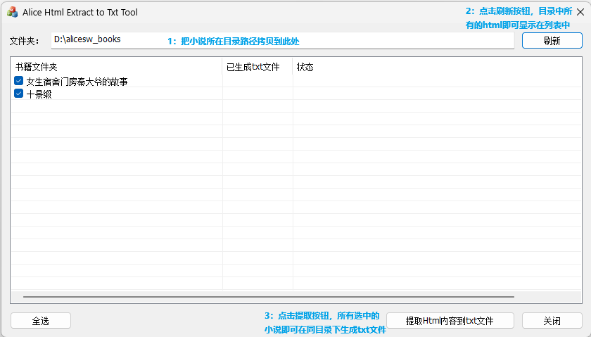

# alicesw-html-2-txt

可将从爱丽丝书屋网站下载的html小说文件，提取纯小说内容，保存为txt文件。

2026-05-03测试通过。

# 1. 如何从爱丽丝书屋获取小说的HTML文件

因为该网站现在禁止另存为html文件，且禁止复制网页内容，目前的办法是：

需在电脑上操作。

浏览器Chrome或Edge上需要安装SingleFile扩展。

在一本小说的书页，点击"开始阅读"，然后在打开的小说阅读页面按住键盘的End键不放，直到该小说的所有章节内容都加载出来。然后使用SingleFile浏览器扩展下载此HTML页面即可。

# 2. 提取HTML内容到txt

需在Windows电脑上编译运行本程序。

## 直接使用已编译好的exe

exe路径：\x64\Release\AliceHtmlExtractor.exe

注意：电脑上必须安装Microsoft Visual C++ 2015-2022 Redistributable (x64) （最新的似乎已改名为Microsoft Visual C++ v14 Redistributable (x64)），可去微软网站下载安装包并安装，安装包名一般为VC_redist.x64.exe。

VC_redist文件夹也提供了此安装文件。

## 编译本程序

VS2022或以上，必须安装MSVC v143。

## 使用本程序

